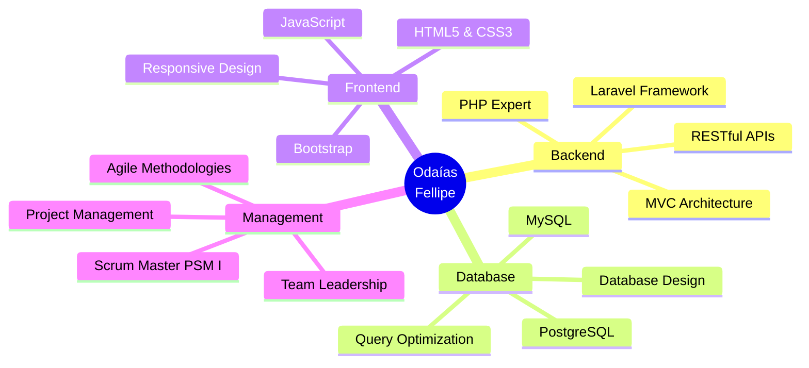

<div align="center">

#  Olá, eu sou Odaías Fellipe


<p align="center">
  
  
  
</p>

```ascii
╔════════════════════════════════════════���══════════════════════╗
║  💻 Desenvolvedor Backend Especialista em PHP & Laravel      ║
║  🎯 Scrum Master Certificado | Apaixonado por Tecnologia     ║
╚═══════════════════════════════════════════════════════════════╝
```

<br>

## 🌐 **Connect With Me**

<p align="center">
  <a href="https://www.linkedin.com/in/odaias-reis/">
    
  </a>
  <a href="mailto:odaiasfellipe@gmail.com">
    
  </a>
  <a href="https://www.dio.me/users/odaiasfellipe">
    
  </a>
</p>


</div>

---

## 🎯 **Sobre Mim**

```typescript
const odaias = {
    code: ["PHP", "JavaScript", "SQL"],
    technologies: {
        backEnd: {
            framework: ["Laravel"],
            databases: ["MySQL", "PostgreSQL"]
        },
        frontEnd: {
            languages: ["HTML5", "CSS3", "JavaScript"]
        },
        devOps: ["Git", "GitHub"],
        tools: ["VS Code", "Postman", "Composer"]
    },
    certifications: ["PSM I - Scrum. org", "MBA em Gerência de Projetos"],
    education: "Tecnólogo em Análise e Desenvolvimento de Sistemas",
    currentFocus: "Construindo soluções escaláveis e eficientes",
    funFact: "Transformo café em código desde 2019 ☕➡️💻"
};
```

<details>
<summary><b>🎓 Formação & Certificações (Clique para expandir)</b></summary>
<br>

| Tipo | Descrição | Instituição |
|------|-----------|-------------|
| 🎓 **Graduação** | Análise e Desenvolvimento de Sistemas | Centro Universitário Carioca |
| 📊 **Pós-Graduação** | MBA em Gerência de Projetos | - |
| 🏅 **Certificação** | Professional Scrum Master I (PSM I) | Scrum.org |

</details>

---

## 🛠️ **Tech Stack**

<div align="center">

### **Backend Development**


### **Frontend Technologies**


### **Database Management**


### **Version Control & Tools**


### **Methodologies & Management**


</div>

---

## 📊 **GitHub Analytics**

<div align="center">
  
  
</div>

<div align="center">
  
</div>

<div align="center">
  
</div>

<div align="center">
  
</div>

---

## 🏆 **Projetos em Destaque**

<div align="center">

<a href="https://github.com/OdaiasFellipe/dio-lab-open-source">
  
</a>

<a href="https://github.com/digitalinnovationone/roadmaps">
  
</a>

</div>

---

## 📈 **Contribution Activity**

<div align="center">
  
<!--START_SECTION:activity-->
  


</div>

---

## 💼 **Experiência & Habilidades**

<div align="center">



</div>

---

## 🎯 **Foco Atual**

<table align="center">
  <tr>
    <td align="center" width="33%">
      
      <br><b>Código Limpo</b>
      <br><sub>Clean Code & SOLID</sub>
    </td>
    <td align="center" width="33%">
      
      <br><b>APIs RESTful</b>
      <br><sub>Desenvolvimento Avançado</sub>
    </td>
    <td align="center" width="33%">
      
      <br><b>Cloud & DevOps</b>
      <br><sub>Expandindo Conhecimentos</sub>
    </td>
  </tr>
</table>

---

## 💬 **Frase Inspiradora**

<div align="center">

```diff
+ "A tecnologia move o mundo, mas são as pessoas que fazem a diferença."
```


</div>

---

## 📫 **Vamos Conversar? **

<div align="center">

Estou sempre aberto a **novos projetos**, **colaborações** e **oportunidades** interessantes! 

<a href="https://www.linkedin.com/in/odaias-reis/">
  
</a>
<a href="mailto:odaiasfellipe@gmail.com">
  
</a>

<br><br>


**⭐ From [OdaiasFellipe](https://github.com/OdaiasFellipe) with 💙**

</div>
