<div align="center">

#  Olá, eu sou Odaías Fellipe


<p align="center">
  
  
  
</p>

```ascii
╔═══════════════════════════════════════════════════════════════╗
║  💻 Desenvolvedor Backend Especialista em PHP & Laravel      ║
║  🎯 Scrum Master Certificado | Apaixonado por Tecnologia     ║
╚═══════════════════════════════════════════════════════════════╝
```

<br>

## 🌐 **Connect With Me**

<p align="center">
  <a href="https://www.linkedin.com/in/odaias-reis/">
    
  </a>
  <a href="mailto:odaiasfellipe@gmail. com">
    
  </a>
  <a href="https://www.dio.me/users/odaiasfellipe">
    
  </a>
</p>


</div>

---

## 🎯 **Sobre Mim**

<div align="center">

<table>
<tr>
<td width="50%">

### 👨‍💻 Desenvolvedor & Tech Enthusiast

Sou um **profissional apaixonado por tecnologia**, especializado em **desenvolvimento backend** com foco em soluções robustas e escaláveis.  

🔹 **Especialista em PHP & Laravel Framework**  
🔹 **Scrum Master Certificado (PSM I)**  
🔹 **MBA em Gerência de Projetos**  
🔹 **Tecnólogo em Análise e Desenvolvimento de Sistemas**

</td>
<td width="50%">

### 🚀 O que eu faço

```yaml
expertise:
  - Desenvolvimento Backend (PHP/Laravel)
  - Arquitetura de APIs RESTful
  - Database Design & Optimization
  - Metodologias Ágeis (Scrum)
  - Gestão de Projetos

hobbies:
  - ☕ Transformo café em código
  - 📚 Sempre estudando algo novo
  - 🎯 Resolvendo problemas complexos
```

</td>
</tr>
</table>

</div>

<details>
<summary><b>🎓 Formação & Certificações (Clique para expandir)</b></summary>
<br>

| Tipo | Descrição | Instituição |
|------|-----------|-------------|
| 🎓 **Graduação** | Análise e Desenvolvimento de Sistemas | Centro Universitário Carioca |
| 📊 **Pós-Graduação** | MBA em Gerência de Projetos | - |
| 🏅 **Certificação** | Professional Scrum Master I (PSM I) | Scrum. org |

</details>

---

## 🛠️ **Tech Stack**

<div align="center">

### **Backend Development**


### **Frontend Technologies**


### **Database Management**


### **Version Control & Tools**


### **Methodologies & Management**


</div>

---

## 📊 **GitHub Analytics**

<div align="center">
  
  
</div>


---

## 🏆 **Projetos em Destaque**

<div align="center">

<a href="https://github.com/OdaiasFellipe/dio-lab-open-source">
  
</a>

<a href="https://github.com/digitalinnovationone/roadmaps">
  
</a>

</div>

---


## 💼 **Experiência & Habilidades**

```mermaid
mindmap
  root((Odaías<br/>Fellipe))
    Backend
      PHP Expert
      Laravel Framework
      RESTful APIs
      MVC Architecture
    Database
      MySQL
      PostgreSQL
      Query Optimization
      Database Design
    Frontend
      HTML5 & CSS3
      JavaScript
      Responsive Design
      Bootstrap
    Management
      Scrum Master PSM I
      Agile Methodologies
      Project Management
      Team Leadership
```

<div align="center">



</div>

---

## 🎯 **Foco Atual**

<table align="center">
  <tr>
    <td align="center" width="33%">
      
      <br><b>Código Limpo</b>
      <br><sub>Clean Code & SOLID</sub>
    </td>
    <td align="center" width="33%">
      
      <br><b>APIs RESTful</b>
      <br><sub>Desenvolvimento Avançado</sub>
    </td>
    <td align="center" width="33%">
      
      <br><b>Cloud & DevOps</b>
      <br><sub>Expandindo Conhecimentos</sub>
    </td>
  </tr>
</table>

---

## 💬 **Frase Inspiradora**

<div align="center">

```diff
+ "A tecnologia move o mundo, mas são as pessoas que fazem a diferença."
```

</div>

---

## 📫 **Vamos Conversar? **

<div align="center">

Estou sempre aberto a **novos projetos**, **colaborações** e **oportunidades** interessantes! 

<a href="https://www.linkedin.com/in/odaias-reis/">
  
</a>
<a href="mailto:odaiasfellipe@gmail.com">
  
</a>

<br><br>


**⭐ From [OdaiasFellipe](https://github.com/OdaiasFellipe) with 💪**

</div>
